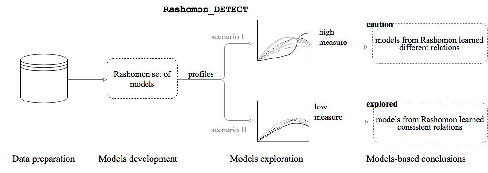

# Rashomon-detect

This repository contains the code for the algorithm Rashomon_DETECT as well as the codes to reproduce the models used in the benchmark described in the paper:

K. Kobylińska, M. Krzyziński, R. Machowicz, M. Adamek, P. Biecek *Exploration of Rashomon Set Assists Explanations
for Medical Data*. [arXiv: ]

